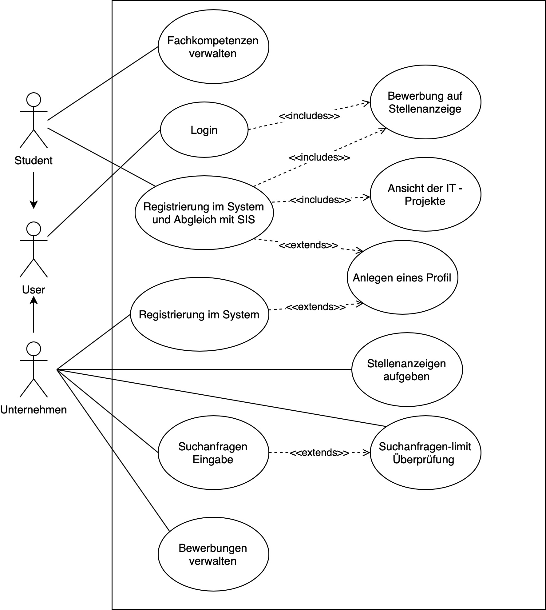

# SE-Übung 5
von Laurenz Dilba (9037743) und Ron Autenrieb (9037538)

## Aufgabe 1

## Aufgabe 2
a)

> Als registrierter und eingeloggter Student möchte ich mich auf Stellenanzeigen bewerben sowie nach diesen suchen.

- **Independent:** Auf Stellenanzeige bewerben und nach Stellenanzeige suchen sind zwei verschiedene Userstorys. Die Registrierung und der Login sind jeweils auch zwei eigene Userstorys.
- **Negotiable:** ist erfüllt.
- **Valuable:** ist erfüllt.
- **Estimatable:** Aufwand ist nicht abschätzbar. Die Userstory ist zu komplex.
- **Small:** Die Userstory besteht aus 4 kleineren Userstorys. Sie ist also nicht klein.
- **Testable:** ist erfüllt.

> Neue Userstorys:

1. Student registriert sich im Portal
2. Student loggt sich im Portal ein    
3. Student sucht nacht Stellenanzeigen     
4. Student bewirbt sich auf Stellenanzeige

b) Keine Änderungen am Modell nötig.

c)
### Testprozedur

Testschritt-Nr. | Testschritt | Soll-Ergebnis | Ist-Ergebnis | Status | Anmerkungen
--- | --- | --- | --- | --- | --- |
1 | Gehe auf Website | Registrierungsformular wird geöffnet | - | - | -
2 | Auf Seite registrieren | Registrierung erfolgreich und Account angelegt | - | - | -
3 | Auf Seite einloggen | Startseite des Portals wird geöffnet | - | - | -
4 | Nach Stellenanzeigen von "Alda" suchen | Passende Stellenanzeigen werden gefiltert angezeigt | - | - | -
5 | Stellenanzeige öffnen | Informationen zur Stellenanzeige wird auf eigener Seite geöffnet | - | - | -
6 | Auf Stellenanzeige bewerben | Formular für die Bewerbung erscheint | - | - | -
7 | Bewerbung abschicken | Unternehmen wird über eingegangene Bewerbung benachrichtigt | - | - | -
 
### Äquivalenzklassen
Parameter | Äquivalenzklasse | Räpresentant
--- | --- | --- |
Suchbegriff | pos_Ä1 | Alda
Suchbegriff | neg_Ä2 | DROP DATABASE users;
